# CDL Zero Architecture

This document provides a detailed technical overview of the CDL Zero application architecture.

## System Overview

```mermaid
flowchart TB
    subgraph Clients["Client Applications"]
        iOS["📱 iOS App<br/>(Apple IAP)"]
        Android["📱 Android App<br/>(Google Play)"]
        Web["🌐 Web App<br/>(Stripe)"]
    end

    subgraph RevenueCat["RevenueCat"]
        RC["Unified Entitlements<br/>& Purchase Management"]
    end

    subgraph Supabase["Supabase Backend"]
        Auth["🔐 Auth<br/>(User Identity)"]
        DB["🗃️ PostgreSQL<br/>(profiles, questions)"]
        Edge["⚡ Edge Functions<br/>(revenuecat-webhook)"]
    end

    iOS --> RC
    Android --> RC
    Web --> RC
    
    iOS --> Auth
    Android --> Auth
    Web --> Auth
    
    RC -->|Webhook| Edge
    Edge -->|Update is_pro| DB
    Auth --> DB
    
    iOS --> DB
    Android --> DB
    Web --> DB
```

## Authentication Flow

## Purchase Flow

## Data Flow

## Key Files Reference

| Category | File | Purpose |
|----------|------|---------|
| **Entry** | `app/_layout.tsx` | Root layout, context providers |
| **Auth** | `context/AuthContext.tsx` | Authentication state management |
| **Subscriptions** | `context/SubscriptionContext.tsx` | Purchase state, entitlements |
| **RevenueCat** | `lib/revenuecat.ts` | iOS/Android SDK wrapper |
| **RevenueCat Web** | `lib/revenuecat-web.ts` | Web + Stripe integration |
| **Supabase** | `lib/supabase.ts` | Database client |
| **Credentials** | `constants/SupabaseCredentials.ts` | Hardcoded public keys |
| **Paywall** | `app/paywall.tsx` | Purchase UI |
| **Questions** | `context/QuestionsContext.tsx` | Question fetching with gating |

## Content Gating Logic

```mermaid
flowchart TD
    Start["User starts quiz"]
    Check{"Is Pro?"}
    
    ProPath["✅ Access all questions"]
    FreePath{"Questions answered < 50?"}
    
    AllowFree["✅ Access free questions"]
    Block["🚫 Show Paywall"]
    
    Start --> Check
    Check -->|Yes| ProPath
    Check -->|No| FreePath
    FreePath -->|Yes| AllowFree
    FreePath -->|No| Block
```

## Security Model

1. **Row Level Security (RLS)**: Premium questions require `is_pro = true` in user profile
2. **Server-Side Validation**: Webhook verifies purchases before updating database
3. **Public Keys Only**: Client contains only anon/public keys (safe to expose)
4. **Question Counter**: Tracked server-side via secure RPC to prevent tampering

## Environment & Credentials

| Key | Location | Type |
|-----|----------|------|
| Supabase URL | `constants/SupabaseCredentials.ts` | Hardcoded |
| Supabase Anon Key | `constants/SupabaseCredentials.ts` | Hardcoded |
| RevenueCat API Key | `lib/revenuecat.ts` | Hardcoded |
| Webhook Secret | Supabase Dashboard | Server-side only |
